# Adhya Architecture Diagrams

Architecture documentation and Mermaid diagrams for the Adhya maternal and child longitudinal healthcare platform.

## Diagram Set

- System Context
- Logical Architecture
- Service Architecture
- Mother → Pregnancy → Delivery → Child data model
- FHIR mapping
- Clinical data flow
- Event processing and alerts
- Security and PQC
- Secure LLM architecture
- Kubernetes deployment
- End-to-end demonstration flow

## Architecture Principles

1. FHIR-first interoperability.
2. Security by design.
3. Least privilege and object-level authorization.
4. Mother → Pregnancy → Delivery → Child longitudinal modeling.
5. Event-driven monitoring.
6. Data minimization for AI.
7. PQC as a research/security layer.
8. Kubernetes-based cloud-native deployment.
9. Synthetic data for development and evaluation.
10. Observable and reproducible experiments.

## System Context

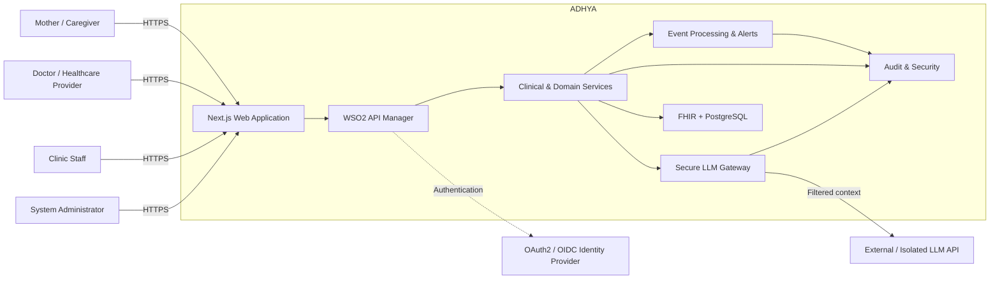

## Logical Architecture

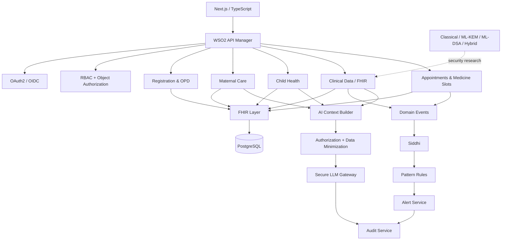

## Mother → Pregnancy → Child

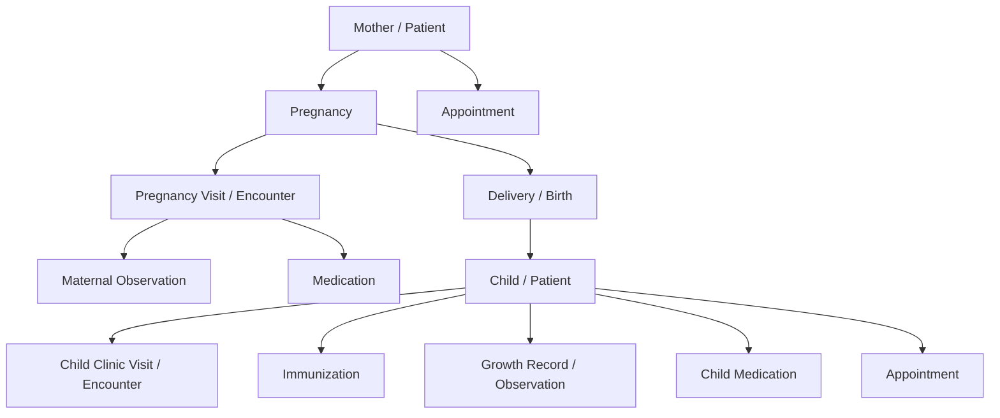

## FHIR Mapping

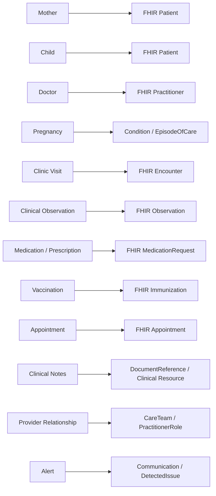

Exact pregnancy, provider-relationship, clinical-note and alert mappings are finalized during FHIR profile design.

## Clinical Data Flow

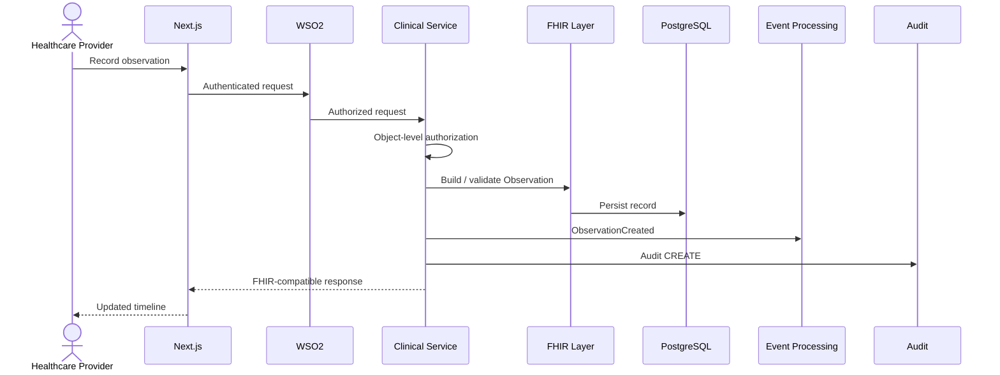

## Event Processing

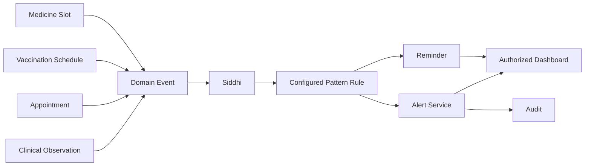

The baseline demonstration may use repeated abnormal blood-pressure observations within a configured time window. This is a monitoring signal, not an autonomous diagnosis.

## Security & PQC

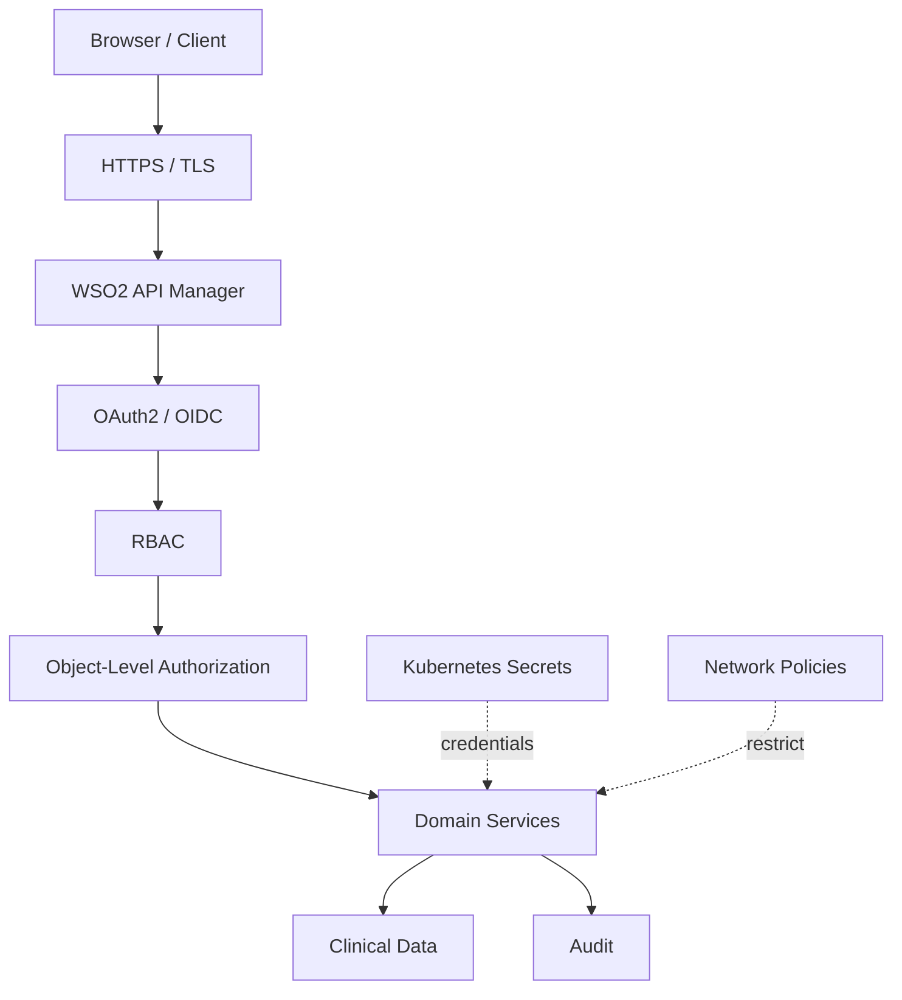

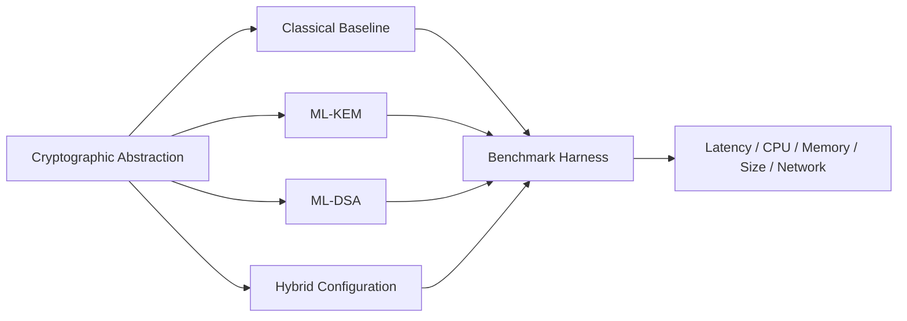

The research compares classical, PQC and hybrid approaches under controlled conditions. PQC is not presented as a guarantee of complete quantum security.

## Secure LLM Architecture

```mermaid
flowchart LR
    Doctor["Authorized Provider"] --> UI["Doctor Dashboard"] --> API["WSO2"] --> Auth["Authentication + RBAC"]
    Auth --> PatientAuth["Patient Authorization"] --> Retrieve["Clinical Data Retrieval"]
    Retrieve --> Min["Data Minimization"] --> DeID["Filtering / De-identification"] --> Context["Context Builder"]
    Context --> Guard["Prompt Injection / Context Isolation"] --> Gateway["Secure LLM Gateway"] --> LLM["LLM API"] --> Validate["Response Validation"] --> Result["Provider Summary"]
    PatientAuth --> Audit["AI Audit"]
    Gateway --> Audit
    Validate --> Audit
```

Rules: no unrestricted database access; patient authorization before retrieval; minimum necessary context; clinical text treated as untrusted prompt content; cross-patient isolation; auditable AI requests; no autonomous diagnosis, prescription or treatment decisions.

## Kubernetes Deployment

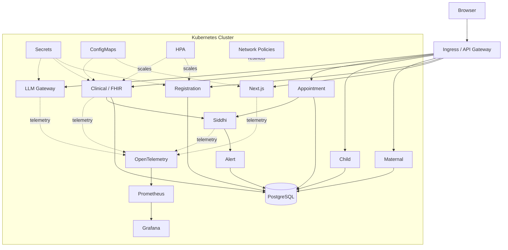

## End-to-End Demonstration

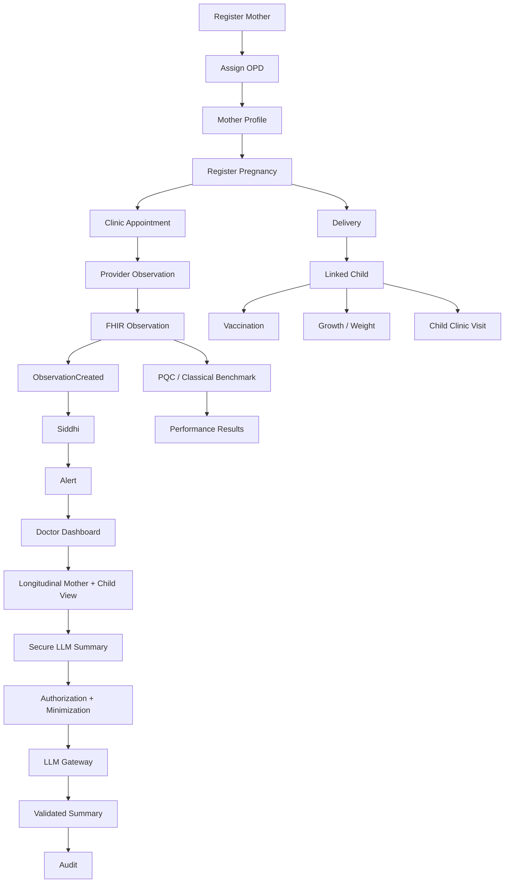

## Ownership

| Area | Primary owner |
|---|---|
| Backend / FHIR | Member 1 |
| Frontend / UX | Member 2 |
| Security / AI | Member 3 |
| Platform / PQC / Observability | Member 4 |

These diagrams are the architectural baseline for the three-month implementation. Exact FHIR profiles, service decomposition and infrastructure sizing can evolve through architecture decision records (ADRs).
