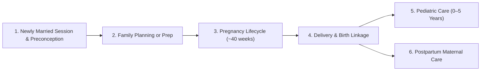
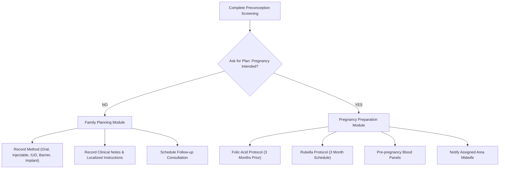
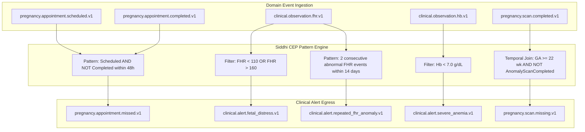

# Mother & Child Longitudinal Domain Model & Clinical Lifecycles

## 1. Executive Summary & Clinical Journey

Adhya models the continuous, longitudinal healthcare journey of maternal and pediatric patients within the Sri Lankan / public healthcare clinic context (MOH / Clinic / Midwife / VOG / Pediatrician).

The core lifecycle consists of four interconnected domain aggregates:

---

## 2. Phase 1: Newly Married Session & Screening (Issue #28)

### 2.1 Couple Registration & Midwife Contact
* **Trigger:** Newly married couple meets Public Health Midwife (PHM) / Medical Officer of Health (MOH) clinic.
* **Identifier:** Maternal/Couple Operational ID + link to Primary Mother `Patient` record.
* **Initial Disease Screening Checklist:**
  * **Blood Hb:** Result (g/dL), timestamp, healthcare provider.
  * **Rubella:** Immunization/titer status (Immune, Non-Immune, Pending).
  * **Thalassemia:** Carrier screening (Negative, Beta-Thal Trait, Alpha-Thal Trait, Confirmed).
  * **Diabetes:** Fasting Blood Sugar (FBS) or Random Blood Sugar (RBS) (mg/dL or mmol/L).
* **Clinical Health Advice:** Lifestyle, nutritional counseling, and recorded localized clinical guidance.

### 2.2 Family Planning Decision Gateway
A critical branch point after screening:

---

## 3. Phase 2: Pregnancy Preparation Protocols (Issue #28)

1. **Folic Acid Protocol:**
   * Prescription: Daily 5mg / 400mcg folic acid at least 3 months prior to planned conception.
   * Tracking: Start date, target end date, daily compliance status, reminder cadence.
2. **Rubella Protocol:**
   * Screening titration check; if non-immune, vaccinate with live-attenuated MMR/Rubella vaccine.
   * Protocol Constraint: Avoid conception for 3 months post-vaccination.
3. **Midwife Notification Event:**
   * State Machine: `PENDING` → `NOTIFIED` → `ACKNOWLEDGED` → `ACTIVE_SUPPORT`.

---

## 4. Phase 3: Active Pregnancy Lifecycle (Issues #5, #28, #29, #30, #31, #32)

### 4.1 Registration & Dating
* **Confirmation Milestone:** Confirmation of pregnancy via UPT / ultrasound (~6-8 weeks).
* **Estimated Date of Delivery (EDD):** Calculated via Naegele's rule from Last Menstrual Period (LMP) and adjusted by Dating Ultrasound scan.
* **Gestational Age (GA):** Calculated continuously in weeks + days:
  $$\text{GA (weeks)} = \frac{\text{Current Date} - \text{LMP}}{7}$$

### 4.2 Clinical Milestones & Assessments
* **First VOG Assessment (Clinical 1 Full Check):**
  * Target: First trimester (8–12 weeks).
  * Assessment: Obstetric risk score, pelvic exam, baseline vitals, initial ultrasound, high-risk flags.

### 4.3 Longitudinal Pregnancy Observations & Vitals
| Clinical Vital / Measurement | Normal Range / Schedule | Clinical Alert Trigger | Event / Siddhi Pattern |
|---|---|---|---|
| **Hemoglobin (Hb)** | $11.0 - 14.0\text{ g/dL}$ | **$\text{Hb} < 7.0\text{ g/dL}$ (Severe Anemia)** | High-priority clinical alert to VOG/PHM |
| **Fetal Heart Rate (FHR)** | $110 - 160\text{ bpm}$ | $\text{FHR} < 110\text{ bpm}$ (Bradycardia) or $> 160\text{ bpm}$ (Tachycardia) | Immediate fetal distress anomaly alert |
| **Repeated FHR Pattern** | Stable across visits | 2+ consecutive abnormal readings or prolonged deceleration | Siddhi temporal window anomaly pattern |
| **Blood Pressure (BP)** | Systolic $< 120$, Diastolic $< 80\text{ mmHg}$ | $\ge 140/90\text{ mmHg}$ or repeat elevation within 4 hrs | Preeclampsia screening alert |
| **Dating & Anomaly Scans** | 11-14 wk (NT), 18-22 wk (Anomaly), 32-36 wk (Growth) | Scan overdue by $> 14\text{ days}$ of target window | `pregnancy.scan.missing.v1` alert |
| **Routine Clinic Visits** | Monthly up to 28 wk; Fortnightly to 36 wk; Weekly to term | Appointment missed beyond grace period ($> 48\text{ hrs}$) | `pregnancy.appointment.missed.v1` alert |

### 4.4 Ultrasound Scans & Image Reference Storage
* Scans store structured metadata in PostgreSQL:
  * `scan_type` (DATING, NUCHAL_TRANSLUCENCY, ANOMALY, GROWTH, BIOPHYSICAL_PROFILE)
  * `gestational_age_days`
  * `biparietal_diameter_mm`, `femur_length_mm`, `abdominal_circumference_mm`, `estimated_fetal_weight_g`
  * `placental_position`, `amniotic_fluid_index`
  * `image_reference`: URI reference to secure object storage (e.g. MinIO / S3 bucket), preserving cryptographic digest / SHA-256 hash.

---

## 5. Phase 4: Delivery & Maternal-Child Linkage (Issues #5, #8)

* **Delivery Record:**
  * Mode of delivery: SVD (Spontaneous Vaginal Delivery), Instrumental, Elective CS, Emergency CS.
  * Maternal outcome, blood loss estimation, postpartum complications.
* **Child Birth Record & Identity Genesis:**
  * Immediate generation of Child `Patient` resource.
  * Immutable link: `Child.mother_patient_id` $\rightarrow$ `Mother.patient_id`.
  * Birth parameters: Birth weight (grams), Birth length (cm), Head circumference (cm).
  * 1-minute and 5-minute APGAR scores.

---

## 6. Phase 5: Pediatric Care & Development (0–5 Years) (Issues #8, #9, #10, #25, #26, #27)

### 6.1 National Immunization Schedule (Birth to 5 Years)
| Timing | Vaccine | Antigen Protection | Route / Site |
|---|---|---|---|
| **At Birth** | BCG | Tuberculosis | Intradermal (Left upper arm) |
| **2 Months** | Pentavalent 1 + OPV 1 + fIPV 1 | DTP, HepB, Hib + Polio | IM (Anterolateral thigh) + Oral |
| **4 Months** | Pentavalent 2 + OPV 2 + fIPV 2 | DTP, HepB, Hib + Polio | IM + Oral |
| **6 Months** | Pentavalent 3 + OPV 3 | DTP, HepB, Hib + Polio | IM + Oral |
| **9 Months** | MMR 1 | Measles, Mumps, Rubella | Subcutaneous |
| **12 Months** | Live JE | Japanese Encephalitis | Subcutaneous |
| **18 Months** | DTP Booster + OPV 4 | Diphtheria, Tetanus, Pertussis, Polio | IM + Oral |
| **3 Years** | MMR 2 | Measles, Mumps, Rubella | Subcutaneous |
| **5 Years** | aTd / DT | Adult Tetanus & Diphtheria | IM |

Vaccine State Machine:
`SCHEDULED` $\rightarrow$ `ADMINISTERED` (with batch #, expiry, provider) | `MISSED` | `CONTRAINDICATED`.

### 6.2 Child Growth Monitoring (0–59 Months)
* **Weight Monitoring (Weight-for-Age):**
  * Measurements plotted against WHO Child Growth Standards.
  * Z-score thresholds:
    * $> +2\text{ SD}$: Overweight
    * $-2\text{ SD}$ to $+2\text{ SD}$: Normal growth
    * $<-2\text{ SD}$: Moderate Underweight
    * $<-3\text{ SD}$: Severe Acute Malnutrition (SAM)
  * **Growth Faltering Alert:** Weight stagnation or drop over 2 consecutive monthly clinic measurements.
* **Height / Length Monitoring (Length/Height-for-Age):**
  * Length measured recumbent ($< 24\text{ months}$); Standing height ($\ge 24\text{ months}$).
  * Z-score thresholds:
    * $<-2\text{ SD}$: Stunted
    * $<-3\text{ SD}$: Severely Stunted

---

## 7. FHIR R4 Standard Resource Mapping

Every clinical domain entity maps cleanly to HL7 FHIR R4:

| Domain Entity | Primary FHIR R4 Resource | Identifiers / Codes |
|---|---|---|
| **Mother Patient** | `Patient` | National ID / Clinic Registration Number |
| **Child Patient** | `Patient` | Child Birth Registration No, `link.other` $\rightarrow$ Mother |
| **Midwife / Doctor** | `Practitioner` / `PractitionerRole` | SLMC License No / MOH Area Role |
| **Pregnancy Lifecycle** | `EpisodeOfCare` & `Condition` | SNOMED CT: `77386006` (Pregnancy) |
| **Clinic / Home Visit** | `Encounter` | `Encounter.participant` = Midwife/Doctor |
| **Screening / Vitals / FHR** | `Observation` | LOINC codes (e.g. `8867-4` Heart rate, `718-7` Hemoglobin) |
| **Ultrasound Scans** | `DiagnosticReport` + `Media` | LOINC `24602-5` (Obstetric ultrasound) |
| **Folic Acid / Medicine** | `MedicationRequest` | RxNorm / National Formulary |
| **Vaccine Dose** | `Immunization` | CVX codes / National Vaccine Code |
| **Growth Assessment** | `Observation` | LOINC `29463-7` (Body weight), `8302-2` (Body height) |
| **Clinical Alerts** | `DetectedIssue` / `Communication` | Alert severity and clinical category |

---

## 8. Event-Driven Architecture & Siddhi Pattern Rules

Domain services publish versioned JSON CloudEvents to the event bus. Siddhi CEP processes streams and emits actionable alerts:

